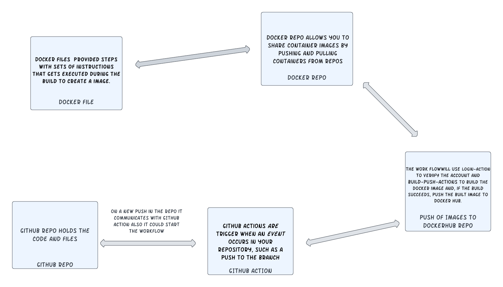

# Project 4

Dougie Townsell 

## Overview 

- CI Project Overview
 
The purpose of this part is to work with building images from stratch and leaninng how to create images from a docker file. Docker images are a template configured with source codes, libraries, external dependencies, tools, and other miscellaneous files that is needed for the container. Containers are isolated processes that excutes code from the docker image 

## Diagram 

## Part 1 - Dockerize it

### Documentation

- Run Project Locally
  - how to install docker + dependencies (WSL2, for example)
  
  Downloaded the Docker Desktop for Mac then moved Docker into the Applications folder from there I was able to start Docker up
  
  From inside the `3120-cicd-NolimitDougie` folder.
  
  - how to build an image from the `Dockerfile`
  - `docker build -t webserver .`
  
  - how to run the container
  - ` docker run -d --name httpd -p 80:80 webserver`
  
  - how to view the project running in the container (open a browser...go to IP and port...)
  - `localhost:80`

## Part 2 - GitHub Actions and DockerHub
## Docker Hub

From `Docker hub` 
 - Clicked on `Repositories`
 - Clicked on `Create repository`
 - Made a name `dtown-1` and set it to `public`

 From `Account settings` go to `security`
  - Clicked on `new access token` created a name on the token and set the permissons 
  - From the command line `docker login -u dtown12` 
  - Put the token contents in as the password 
  
- How to push container image to Dockerhub (without GitHub Actions)
 - `docker push dtown12/dtown-1:latest`

## Github Actions

From the Github repo `3120-cicd-NolimitDougie`

- Clicked on `settings`
- On the left of the tool bar went and found `Secerets and variables` then clicked on `actions`
- Clicked on `New repository secret`
- Inputted a name in for the secret
- Put in my Docker Hub password in for the secret

- Behavior of GitHub workflow
   The workflow builds and pushes images to Dockerhub, while authenticating with your Dockerhub username & access token. 
   It occurs when changes are `pushed` to the GitHub repo

  - what variables in workflow are custom to your project
    - think may need to be changed if someone else is going to use it or you reuse it

 These customs variables in my workflow could change if it's reused the `name` , `username`,` password`, ` images`, `tags` also the `context`.
