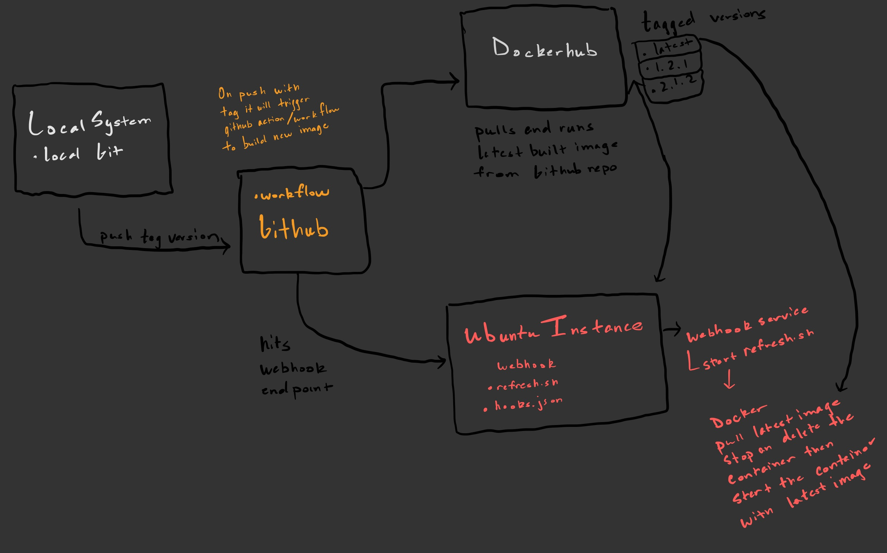

# Project 5

Dougie Townsell 

## Part 1 - Semantic Versioning

## Diagram

### Documentation

Create `README-CD.md` in main folder of your repo that details the following:

- CD Project Overview

-  For this project we using semantic versioning in conjunction with my Docker image. We are updating our workflow so GitHub action can create a event when a tag is pushed and trigger the workflow. Semantic versioning would allow for all previous and current images to be recorded in DockerHub. This increases traceability by allowing the you to view changes that have been made over time. 

- How to generate a `tag` in `git` / GitHub

Add your changes using `git add <file_names>` 
Then commit the changes using git commit. To create the tag for the commit use `git tag -a v#.#.#`.
To push the tagged commit, use `git push origin v#.#.#`.

- Behavior of GitHub workflow
  - what does it do and when

The GitHub workflow is triggered after a `push` is made to the `main` branch or a `tagged commit` is pushed. It builds a new Docker image from the Dockerfile in this repository and pushes it to DockerHub. The image in DockerHub will be tagged with latest the full `tag` version number

- Link to Docker Hub repository (as additional proof)

[Dtown12/dtown-1 Docker Repository](https://hub.docker.com/repository/docker/dtown12/dtown-1/general)

## Part 2 - Deployment

### Documentation

Update `README-CD.md` in main folder of your repo to include:

- How to install Docker to your instance

`sudo apt-get remove docker docker-engine docker.io containerd runc`

`sudo apt-get update`

`sudo apt-get install \
  ca-certificates \
  curl \
  gnupg`
  
`sudo mkdir -m 0755 -p /etc/apt/keyrings`

`curl -fsSL https://download.docker.com/linux/ubuntu/gpg | sudo gpg --dearmor -o /etc/apt/keyrings/docker.gpg`

`echo \
"deb [arch="$(dpkg --print-architecture)" signed-by=/etc/apt/keyrings/docker.gpg] https://download.docker.com/linux/ubuntu \
"$(. /etc/os-release && echo "$VERSION_CODENAME")" stable" | \
sudo tee /etc/apt/sources.list.d/docker.list > /dev/null`

`sudo apt-get update`

`sudo apt-get install docker-ce docker-ce-cli containerd.io docker-buildx-plugin docker-compose-plugin`

`sudo docker run hello-world`

## Container restart script

The script is located inside of the `WebHook/refresh.sh`. To get the latest version, it pulls from DockerHub, stops/deletes the existing instance, then runs a new one. 

## WebHook Set-up 

- Setting up a `webhook` on the server
  - How to install [adnanh's `webhook`](https://github.com/adnanh/webhook) to server
  
  - Command to install webhook goes here. 

   `sudo apt-get install webhook`
   
    created `/etc/webhook.conf` then passed in the contents from `/hooks.json` to set up the webhook configuration file it executes the container `refresh.sh` script when it is triggered
   
   `sudo systemctl start webhook`
  

## WebHook Task Definition File

`hooks.json` creates an endpoint named `redeploy-webhook` that will call refresh.sh script with the working directory `/home/ubuntu/`. It should be located at /etc/webhook.conf

- How to configure GitHub OR DockerHub to message the listener 

`On Docker Hub go to your repository page`

`Click Webhooks`

`Enter a name and enter this URL: http://<EC2 elastic IP>:9000/hooks/redeploy-webhook`

`Click Create`

- RECORD your whole workflow process - from `commit` and `push` to your server getting a fresh image

### Resources

- [Using GitHub actions and `webhook`s](https://levelup.gitconnected.com/automated-deployment-using-docker-github-actions-and-webhooks-54018fc12e32)
- [Using DockerHub and `webhook`s](https://blog.devgenius.io/build-your-first-ci-cd-pipeline-using-docker-github-actions-and-webhooks-while-creating-your-own-da783110e151)
  - Note: this has been the method focused on in lecture
